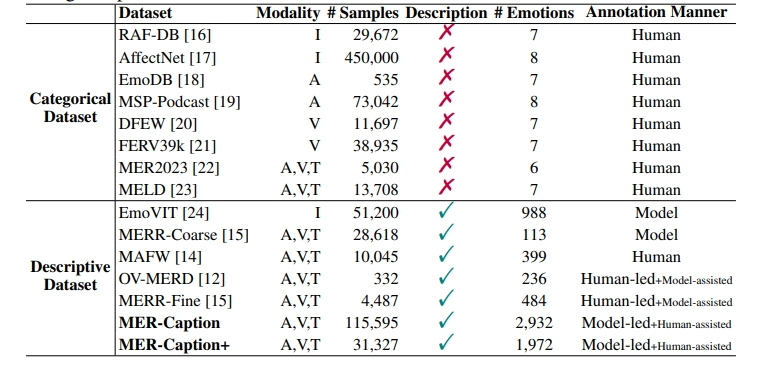

# MER2025-DES: Data Augmentation and Mamba-enhanced Temporal Pre-Fusion for Multimodal Affective Explanation

[](https://arxiv.org/abs/2504.19423)
[](https://arxiv.org/abs/2504.19423)
[](LICENSE)

&gt; **🏆 MER2025 Challenge Solution**  
&gt; This repository contains our official solution for the **MER2025 Multimodal Emotion Recognition with Description Generation (MER-DES)** track.  
&gt; We introduce a novel framework combining **automated reasoning data augmentation** with a **Mamba-based temporal pre-fusion mechanism** to generate human-aligned, explainable emotion descriptions from video, audio, and text.


## 🔍 Overview

Multimodal emotion reasoning requires fine-grained alignment across visual, auditory, and textual cues. Our framework addresses two core challenges in MER-DES:

1. **Data Scarcity**: The only human-annotated reasoning dataset (OV-MERD) contains merely **332 samples**, insufficient for training Multimodal Large Language Models (MLLMs).
2. **Temporal Dynamics Loss**: Standard tokenization and self-attention mechanisms in LLMs often discard fine-grained emotional evolutions in temporally evolving audio-visual streams.

### Our Solution

| Component | Description |
|-----------|-------------|
| **Data Engine** | Fine-tuned AffectGPT on OV-MERD → generate reasoning on SIMSv2 → **Qwen3 consistency filtering** → **human revision** → **4,403 high-quality samples** |
| **MTF Module** | **Mamba-enhanced Temporal pre-Fusion** capturing long-range temporal dependencies and cross-modal gating before LLM decoding |
| **Backbone** | Qwen2.5-7B-Instruct with frozen SigLIP-SO400M (visual) and HuBERT-L (audio) encoders |

---

## ✨ Key Features

- 🎯 **Human-Aligned Reasoning**: Two-stage quality control (automatic + manual) ensures generated training data reflects natural human inference processes.
- 🧠 **Mamba Temporal Fusion**: Parallel SSM streams with cross-modal gating explicitly model emotional dynamics across audio and visual modalities.
- 🔗 **Cross-Modal Alignment**: Attention-weighted pooling + gated interaction prevents fine-grained signal loss during tokenization.
- 📊 **State-of-the-Art Performance**: Significantly outperforms AffectGPT on emotion description coherence and interpretability.

---

## 🏗️ Architecture

### MTF (Mamba-enhanced Temporal pre-Fusion) Detail

The MTF module operates on temporal sequences before LLM tokenization:

1. **Projection**: `F'a = Linear(Fa)`, `F'v = Linear(Fv)` → shared `ℝ^(T×d)`
2. **Normalization & Expansion**: `xa = Linear(Norm(F'a))` → `ℝ^(T×2d)`
3. **Short-term Dynamics**: `ha = SiLU(Conv1d(xa))`
4. **Long-range Modeling**: `Ta = SSM(ha)` (Mamba selective state space)
5. **Cross-Modal Gating**: `Ta = Ta ⊙ hv`, `Tv = Tv ⊙ ha`

This preserves fine-grained emotional transitions (e.g., tone shifts, facial expression changes) that standard pooling would lose.

## Run with our model
```bash 
CUDA_VISIBLE_DEVICES=1 python -u inference_hybird.py --zeroshot --dataset='MER2025OV' --outside_user_message="please consider the following points: observe facial expressions and body movements, evaluate speech rate, tone, and volume, and analyze what the character says. Finally, infer the person's emotional state and provide your reasoning process." --cfg-path=train_configs/msa_outputhybird_bestsetup_bestfusion_frame_lz.yaml --options "inference.test_epoch=5" "inference.base_root=output/results-description"
```

# Official Run
</h5>

This project is mainly drawn from our previous work on OV-MER and AffectGPT: https://github.com/zeroQiaoba/AffectGPT

## 🛠️ Requirements and Installation
My Dependencies (We have not tested other envs):
* CUDA Version == 12.1

**[Environment Preparation]**
```bash
# we mainly depend on vllm2, but some baselines depend on whisperx
conda env create -f environment_vllm2.yml
conda env create -f environment_whisperx.yml
```

## 🚀 Dataset
In MER2025, we provide two training datasets, **OV-MERD** and **MER-Caption+**.
```bash
dataset # including both OV-MERD and MER-Caption+ Dataset
├── mer2025-dataset # Available at: https://huggingface.co/datasets/MERChallenge/MER2025
|   ├── video # all training data, including 132,171 samples
|   ├── audio # pre-extracted audio
|   ├── openface_face # # pre-extracted face files
|   ├── subtitle_chieng.csv # pre-extracted subtitle content
|   ├── track2_train_mercaptionplus.csv # MER-Caption+ Dataset (OV labels)
|   ├── track3_train_mercaptionplus.csv # MER-Caption+ Dataset (Description)
|   ├── track2_train_ovmerd.csv # OV-MERD Dataset (OV labels)
|   ├── track3_train_ovmerd.csv # OV-MERD Dataset (Description)
|   ├── track_all_candidates.csv # Only useful for participants in MER2025 [all test samples exist in these candidates]
```

Their dataset statistics are provided as below:
<p></p>

<details open><summary>💡 Papers ✨. </summary><p>
<!--  may -->

> [**AffectGPT: A New Dataset, Model, and Benchmark for Emotion Understanding with Multimodal Large Language Models**](https://arxiv.org/abs/2501.16566) <br>
> Zheng Lian, Haoyu Chen, Lan Chen, Haiyang Sun, Licai Sun, Yong Ren, Zebang Cheng, Bin Liu, Rui Liu, Xiaojiang Peng, Jiangyan Yi, Jianhua Tao <br>

> [**OV-MER: Towards Open-Vocabulary Multimodal Emotion Recognition**](https://arxiv.org/abs/2410.01495) <br>
> Zheng Lian, Haiyang Sun, Licai Sun, Haoyu Chen, Lan Chen, Hao Gu, Zhuofan Wen, Shun Chen, Siyuan Zhang, Hailiang Yao, Bin Liu, Rui Liu, Shan Liang, Ya Li, Jiangyan Yi, Jianhua Tao <br>


</p></details>

## ✨ AffectGPT Training & Inference

### Pretrained Checkpoints
| Model Name     | Model Type |
|:----------------|:------------:|
| [clip-vit-large-patch14](https://huggingface.co/openai/clip-vit-large-patch14)  | Visual Encoder  |
| [chinese-hubert-large](https://huggingface.co/TencentGameMate/chinese-hubert-large)  | Audio Encoder |
| [Qwen2.5-7B-Instruct](https://huggingface.co/Qwen/Qwen2.5-7B-Instruct)  | LLM |
| [mercaptionplus_outputhybird_bestsetup_bestfusion_face_lz](https://pan.baidu.com/s/1R2q9_ZLtn6tgfUs4zX8gUw?pwd=givh)  | Training on **MERCaption+** and take pre-extracted **face** as input  |
| [mercaptionplus_outputhybird_bestsetup_bestfusion_frame_lz](https://pan.baidu.com/s/1iO-KyekHH3t7hDOVHy4ypg?pwd=yex1)  | Training on **MERCaption+** and take origin **frame** as input  |
| [ovmerd_outputhybird_bestsetup_bestfusion_face_lz](https://pan.baidu.com/s/1nsp1FUnYAXKMJ5kURGFc2A?pwd=ujsi)  | Training on **OV-MERD** and take pre-extracted **face** as input  |
| [ovmerd_outputhybird_bestsetup_bestfusion_frame_lz](https://pan.baidu.com/s/1Z01zSUAIlEoBaW5V7I1Pfg?pwd=4xen)  | Training on **OV-MERD** and take origin **frame** as input  |


### Data and Pre-trained Checkpoints Structure
```bash
[1] structure
dataset # including both OV-MERD and MER-Caption+ Dataset
├── mer2025-dataset # Available at: https://huggingface.co/datasets/MERChallenge/MER2025
|   ├── video # all training data, including 132,171 samples
|   ├── audio # pre-extracted audio
|   ├── openface_face # # pre-extracted face files
|   ├── subtitle_chieng.csv # pre-extracted subtitle content
|   ├── track2_train_mercaptionplus.csv # MER-Caption+ Dataset (OV labels)
|   ├── track3_train_mercaptionplus.csv # MER-Caption+ Dataset (Description)
|   ├── track2_train_ovmerd.csv # OV-MERD Dataset (OV labels)
|   ├── track3_train_ovmerd.csv # OV-MERD Dataset (Description)
|   ├── track_all_candidates.csv # Only useful for participants in MER2025 [all test samples exist in these candidates]

MER2025_Track23
├── models # Available at: https://pan.baidu.com/s/1IvC4H7Xt1AzMFocGMBBbHQ?pwd=hzf9
│   ├── chinese-hubert-large # audio encoders
│   ├── clip-vit-large-patch14 # video encoders
│   ├── Qwen2.5-7B-Instruct # LLM

[2] Please change xxx in config.py to your own path.
```

### Training
```bash
# model1: Training on MERCaptionPlus (face)
CUDA_VISIBLE_DEVICES=0 python -u train.py 
--cfg-path=train_configs/mercaptionplus_outputhybird_bestsetup_bestfusion_face_lz.yaml

# model2: Training on MERCaptionPlus (frame)
CUDA_VISIBLE_DEVICES=0 python -u train.py 
--cfg-path=train_configs/mercaptionplus_outputhybird_bestsetup_bestfusion_frame_lz.yaml

# model3: Training on OV-MERD (face)
CUDA_VISIBLE_DEVICES=0 python -u train.py 
--cfg-path=train_configs/ovmerd_outputhybird_bestsetup_bestfusion_face_lz.yaml

# model4: Training on OV-MERD (frame)
CUDA_VISIBLE_DEVICES=0 python -u train.py 
--cfg-path=train_configs/ovmerd_outputhybird_bestsetup_bestfusion_frame_lz.yaml
```

### Inference Code
1. Pre-trained Checkpoints Structure

If you want to skip the above training process, we also provide pretrained weights.
```bash
MER2025_Track23
├── models # Available at: https://pan.baidu.com/s/1IvC4H7Xt1AzMFocGMBBbHQ?pwd=hzf9
│   ├── chinese-hubert-large # audio encoders
│   ├── clip-vit-large-patch14 # video encoders
│   ├── Qwen2.5-7B-Instruct # LLM
├── output
│   ├── mercaptionplus_outputhybird_bestsetup_bestfusion_face_lz # Available: https://pan.baidu.com/s/1R2q9_ZLtn6tgfUs4zX8gUw?pwd=givh
│   ├── mercaptionplus_outputhybird_bestsetup_bestfusion_frame_lz # Available: https://pan.baidu.com/s/1iO-KyekHH3t7hDOVHy4ypg?pwd=yex1
│   ├── ovmerd_outputhybird_bestsetup_bestfusion_face_lz # Available: https://pan.baidu.com/s/1nsp1FUnYAXKMJ5kURGFc2A?pwd=ujsi
│   ├── ovmerd_outputhybird_bestsetup_bestfusion_frame_lz # Available: https://pan.baidu.com/s/1Z01zSUAIlEoBaW5V7I1Pfg?pwd=4xen
```

2. Inference => generate OV labels (**MER2025-Track2**)
save to *./output/results-mer2025ov*
```bash
# case1: Training on MERCaptionPlus (face), test for MER2025-Track2
CUDA_VISIBLE_DEVICES=0 python -u inference_hybird.py --zeroshot --dataset='MER2025OV' 
--cfg-path=train_configs/mercaptionplus_outputhybird_bestsetup_bestfusion_face_lz.yaml 
--options "inference.test_epoch=35"

# case2: Training on MERCaptionPlus (frame), test for MER2025-Track2
CUDA_VISIBLE_DEVICES=0 python -u inference_hybird.py --zeroshot --dataset='MER2025OV' 
--cfg-path=train_configs/mercaptionplus_outputhybird_bestsetup_bestfusion_frame_lz.yaml 
--options "inference.test_epoch=30" 

# case3: Training on OV-MERD (face), test for MER2025-Track2
CUDA_VISIBLE_DEVICES=0 python -u inference_hybird.py --zeroshot --dataset='MER2025OV' 
--cfg-path=train_configs/ovmerd_outputhybird_bestsetup_bestfusion_face_lz.yaml 
--options "inference.test_epoch=40" 

# case4: Training on OV-MERD (frame), test for MER2025-Track2
CUDA_VISIBLE_DEVICES=0 python -u inference_hybird.py --zeroshot --dataset='MER2025OV' 
--cfg-path=train_configs/ovmerd_outputhybird_bestsetup_bestfusion_frame_lz.yaml 
--options "inference.test_epoch=45" 
```

3. Inference => generate Descriptions (**MER2025-Track3**)
save to *./output/results-description-mer2025ov*
```bash
# case1: Training on MERCaptionPlus (face), test for MER2025-Track2
CUDA_VISIBLE_DEVICES=0 python -u inference_hybird.py --zeroshot --dataset='MER2025OV' 
--outside_user_message="Please infer the person's emotional state and provide your reasoning process."
--cfg-path=train_configs/mercaptionplus_outputhybird_bestsetup_bestfusion_face_lz.yaml 
--options "inference.test_epoch=35" "inference.base_root=output/results-description"

# case2: Training on MERCaptionPlus (frame), test for MER2025-Track2
CUDA_VISIBLE_DEVICES=0 python -u inference_hybird.py --zeroshot --dataset='MER2025OV' 
--outside_user_message="Please infer the person's emotional state and provide your reasoning process."
--cfg-path=train_configs/mercaptionplus_outputhybird_bestsetup_bestfusion_frame_lz.yaml 
--options "inference.test_epoch=30" "inference.base_root=output/results-description"

# case3: Training on OV-MERD (face), test for MER2025-Track2
CUDA_VISIBLE_DEVICES=0 python -u inference_hybird.py --zeroshot --dataset='MER2025OV' 
--outside_user_message="Please infer the person's emotional state and provide your reasoning process."
--cfg-path=train_configs/ovmerd_outputhybird_bestsetup_bestfusion_face_lz.yaml 
--options "inference.test_epoch=40" "inference.base_root=output/results-description"

# case4: Training on OV-MERD (frame), test for MER2025-Track2
CUDA_VISIBLE_DEVICES=0 python -u inference_hybird.py --zeroshot --dataset='MER2025OV' 
--outside_user_message="Please infer the person's emotional state and provide your reasoning process."
--cfg-path=train_configs/ovmerd_outputhybird_bestsetup_bestfusion_frame_lz.yaml 
--options "inference.test_epoch=45" "inference.base_root=output/results-description"
```

python ovlabel_extraction.py
